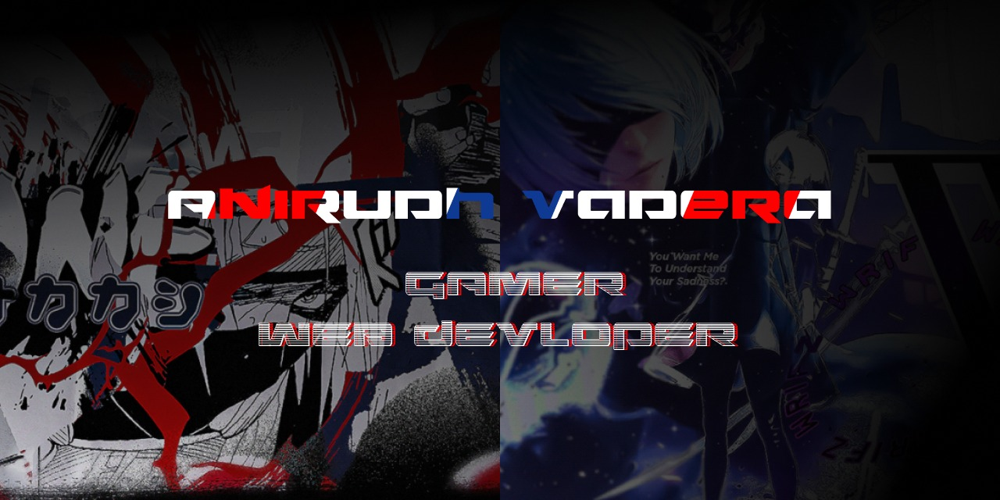

# Hi there, I'm Anirudh Vadera - aka [BooGEYMaN---->>][steam] 👋

## I'm a Developer, Gamer, Engineer, and a Weeb!!

- 🏫 I'm cuurently pursuing B-TECH in Computer Science at [VIT,Vellore University.][vit]
- 🌱 I’m currently learning everything 🤣
- 👯 I’m looking forward to get a Internship
- 👀 I'm a night coder.
- 🥅 2022 Goals: Learn more about ThreeJS,Backend Development,Desktop Applications and MERN Stack.
- ⚡ Fun fact: I love to play Football, play video games, watch web series.
- 💞️ I’m looking to collaborate on some interesting projects.

---

### Connect with me:

&nbsp;&nbsp;

&nbsp;&nbsp;

&nbsp;&nbsp;

&nbsp;&nbsp;

&nbsp;&nbsp;

&nbsp;&nbsp;

---

### Languages and Tools:

- FrontEnd:

- ServerSide Development:

- BackEnd:

- Programming:

 

 
 

General:

---

### Github Profile 📊

 
  

  

---

### Github Stats

&nbsp;&nbsp;&nbsp;

---

# Productivity Stats 📈:

<table>
  <tr>
    <td></td>
   </tr> 
   <tr>
      <td></td>
  </td>
  </tr>
</table>

---

#### Top Repositories

 

---

#### Watch my contributions being eaten by a snake 😢

  

[twitter]: https://twitter.com/vadera_anirudh?t=s1-WMFJPoU78f2IvSQ2qaA&s=08
[instagram]: https://www.instagram.com/anirudhvadera/
[linkedin]: https://www.linkedin.com/in/anirudh-vadera-8836ba237/
[steam]: https://steamcommunity.com/id/BooGEYMaN___/
[vit]: https://vit.ac.in/
