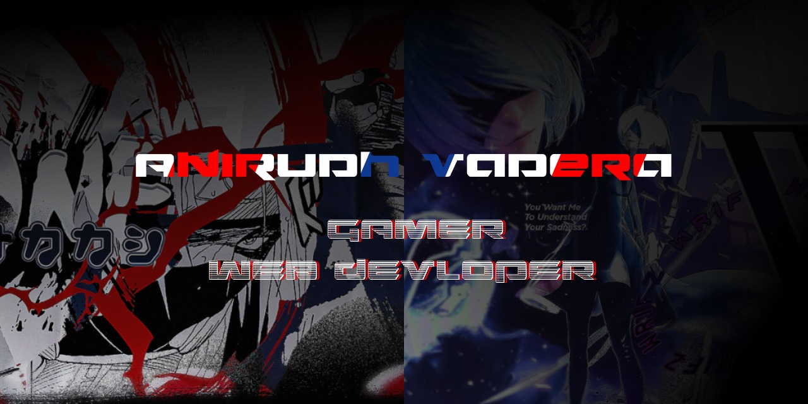
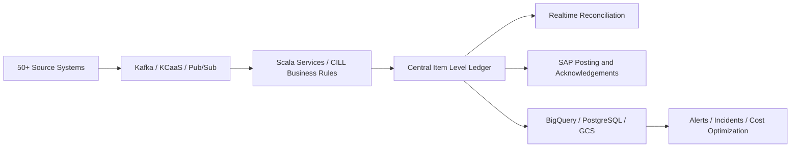

<!-- ::: Code Generated by Copilot [9e095e20-75ff-4f24-8abf-e4df4b7b90a9]. This comment will be removed automatically after the file is saved ::: -->
# Anirudh Vadera

**Software Engineer III, Finance Technology | Distributed systems, data platforms, and event-driven financial workflows**

[Portfolio](https://anirudh-vadera.github.io/Portfolio2023-24/) | [LinkedIn](https://www.linkedin.com/in/anirudh-vadera-8836ba237/) | [LeetCode](https://leetcode.com/u/anirudh00711/) | [Email](mailto:anirudhvadera@gmail.com)

I build production systems where correctness, scale, and operational clarity matter. My current work sits at the intersection of finance technology, distributed backend systems, event streaming, cloud data platforms, and reconciliation workflows at Walmart Global Tech.

<!-- ::: Code Generated by Copilot [4c9d0f6f-08d1-4606-93f8-e20eab97fd53]. This comment will be removed automatically after the file is saved ::: -->

    

## Connect With Me

&nbsp;&nbsp;

&nbsp;&nbsp;

&nbsp;&nbsp;

&nbsp;&nbsp;

## Quick Signal

| Area | Proof |
| --- | --- |
| Current role | Software Engineer III at Walmart Global Tech, Finance Technology - Central Item Level Ledger |
| Production scale | CILL components support journaling for roughly **85% of Walmart revenue** and around **100K transactions/day** |
| Cloud impact | Owned archival of **104 TB** of production data, saving roughly **$45K/year** |
| Reliability impact | Expanded Litmus regression coverage across **128+ repos** and **20+ pre-SAP rules**, reducing production failures by **50%** |
| Performance impact | Optimized PySpark to PostgreSQL upserts from about **3 hours to 13 minutes** |
| Competitive programming | LeetCode Knight, top 5% globally, **1000+ problems solved**, peak rating **1981** |

## What I Am Building Now

- Expanding CILL for MXCAM and LATAM Finance 2.0 across **6 countries** and **50+ source systems**.
- Designing local-currency, exchange-rate, currency-limitation, and document-splitting rules for source-to-SAP journal flows.
- Moving batch acknowledgement and reconciliation paths toward near real time to reduce detection and recovery time.
- Building tools and workflows around LLMs, RAG, graph-backed knowledge systems, and developer productivity.

## Engineering Map

```mermaid
flowchart LR
    Sources[50+ Source Systems] --> Events[Kafka / KCaaS / Pub/Sub]
    Events --> Rules[Scala Services / CILL Business Rules]
    Rules --> Ledger[Central Item Level Ledger]
    Ledger --> Recon[Realtime Reconciliation]
    Ledger --> SAP[SAP Posting and Acknowledgements]
    Ledger --> Data[BigQuery / PostgreSQL / GCS]
    Data --> Ops[Alerts / Incidents / Cost Optimization]
```

## Core Stack

<!-- ::: Code Generated by Copilot [40b46863-ff6b-456d-ab3a-723555dc488a]. This comment will be removed automatically after the file is saved ::: -->
- **Languages:** Scala, Python, SQL
- **Big Data and Streaming:** Apache Spark, Spark Streaming, Kafka, KCaaS, Airflow, ETL Pipelines, Data Modeling
- **Cloud and Infrastructure:** Google Cloud Platform, BigQuery, Pub/Sub, Cloud Storage, Storage Transfer Service, AutoClass, Scheduled Queries, Kubernetes, ArgoCD
- **Backend and Systems:** Microservices, Distributed Systems, Event-Driven Architecture, REST APIs, PostgreSQL, MySQL, Flyway
- **Testing and Delivery:** ScalaTest, Mockito, Integration Testing, Litmus, CI/CD
- **AI and Knowledge Systems:** LLMs, RAG, Vector DB, Graph DB, ChromaDB, NetworkX
- **Scala Ecosystem:** ZIO, Akka/Pekko, Apache Camel

## Selected Work

| Project / Initiative | What changed |
| --- | --- |
| **Cloud Storage Archival Framework** | Designed and owned GCS archival for 13+ month-old production data, moving **104 TB** to archival storage and reducing yearly cloud cost. |
| **Audit Event Listener Enhancement** | Built REST APIs and parallel event processing for large backlogs, cutting event trigger latency by **2-3 seconds** and reducing 1,000-message backlog processing by about **3 hours**. |
| **Ending Inventory Reconciliation** | Contributed to event-driven, line-item-level reconciliation and backward acknowledgements, moving finance workflows from batch toward near real time. |
| **Recon Adapter Enhancements** | Built unified reconciliation capabilities that improved failure visibility, reduced manual troubleshooting, and lowered MTTD/MTTR. |
| **Lead Company Code Derivation** | Implemented **7 derivation strategies** to improve tax accuracy and compliance in finance workflows. |
| **GLAD PySpark Upsert** | Optimized DataFrame upserts into PostgreSQL, reducing runtime from roughly **3 hours to 13 minutes**. |
| **TwinAI** | Designed a passive knowledge digital twin concept that captures IDE, terminal, browser, meeting, and LLM context into queryable knowledge bases with privacy guardrails. |
| **CodeSage AI** | Built an LLM/RAG wiki pipeline that converts raw documents into linked, human-readable organization knowledge pages. |

## Public Projects

- [Portfolio2023-24](https://anirudh-vadera.github.io/Portfolio2023-24/) - interactive React and Three.js portfolio.
<!-- ::: Code Generated by Copilot [7e3f35d9-0b48-4e7f-8df3-72b91327203c]. This comment will be removed automatically after the file is saved ::: -->
- Web Assist - Chrome extension for navigating complex websites and inspecting page content.
- [MINECO](https://github.com/ANIRUDH-VADERA/MINECO) - ESP32-based mine gas safety prototype using MQ135 and DHT11 sensors.
- [Relevant Document Retrieval](https://github.com/ANIRUDH-VADERA/RELEVANT-DOCUMENT-RETRIEVAL) - NLP retrieval project for finding relevant documents from large corpora.
- [Space Exploration](https://github.com/ANIRUDH-VADERA/Space_Exploration) - data visualization project around space and dark matter datasets.

## Career Timeline

| Period | Role |
| --- | --- |
| May 2026 - Present | Software Engineer III, Walmart Global Tech - Finance Technology, CILL |
| Jul 2024 - Apr 2026 | Software Engineer II, Walmart Global Tech - Finance Technology, CILL |
| Jan 2024 - Jun 2024 | Software Engineering Intern, Walmart Global Tech - Finance Technology, CILL |
| May 2023 - Jul 2023 | Software Development Engineer Intern, Walmart Global Tech - SAP Accounts Receivable |

## Education and Recognition

- B.Tech in Computer Science and Engineering, VIT Vellore - **CGPA 9.54/10**.
- Making a Difference Award, Walmart Global Tech, FY 2025.
- Finalist, Walmart FDF AI Hackathon.
- Merit Scholarship recipient at VIT for 2020-2021 and 2021-2022.
- Program Representative, CSE Core Branch, 2021-2022 and 2022-2023.
- Senior Core Member, Apple Developers Group VIT. Built recruitment, official website, Link Tree, and Chrome extension projects; conducted React onboarding.

## Interview Hooks

Ask me about:

- Designing reconciliation systems where missing one line item is a business problem, not just a technical bug.
- Turning a multi-hour PySpark/PostgreSQL job into a minutes-level workflow.
- Cost-aware cloud data movement in GCS and BigQuery.
- Building event-driven source-to-ledger-to-SAP pipelines.
- How I would design an internal knowledge twin for engineering teams without ignoring privacy boundaries.

## Where To Look Next

<!-- ::: Code Generated by Copilot [e834f4c5-f156-4dc7-84cd-f5eda8a72927]. This comment will be removed automatically after the file is saved ::: -->
- Portfolio for the polished walkthrough: [anirudh-vadera.github.io/Portfolio2023-24](https://anirudh-vadera.github.io/Portfolio2023-24/)
- GitHub repositories for public project code: [github.com/ANIRUDH-VADERA](https://github.com/ANIRUDH-VADERA)
- LeetCode for algorithmic consistency and contest history: [leetcode.com/u/anirudh00711](https://leetcode.com/u/anirudh00711/)

## GitHub Profile

<!-- ::: Code Generated by Copilot [4c9d0f6f-08d1-4606-93f8-e20eab97fd53]. This comment will be removed automatically after the file is saved ::: -->

    

## GitHub Stats

<!-- ::: Code Generated by Copilot [4c9d0f6f-08d1-4606-93f8-e20eab97fd53]. This comment will be removed automatically after the file is saved ::: -->

    
    

    
    

## Productivity Stats

<!-- ::: Code Generated by Copilot [4c9d0f6f-08d1-4606-93f8-e20eab97fd53]. This comment will be removed automatically after the file is saved ::: -->

    

    

## Top Repositories

<!-- ::: Code Generated by Copilot [4c9d0f6f-08d1-4606-93f8-e20eab97fd53]. This comment will be removed automatically after the file is saved ::: -->
| Repository | Why it matters |
| --- | --- |
| [Portfolio2023-24](https://github.com/ANIRUDH-VADERA/Portfolio2023-24) | Interactive React and Three.js portfolio that presents my work, impact, and technical profile. |
| [MINECO](https://github.com/ANIRUDH-VADERA/MINECO) | IoT safety prototype with ESP32, gas sensing, and temperature monitoring. |
| [Relevant Document Retrieval](https://github.com/ANIRUDH-VADERA/RELEVANT-DOCUMENT-RETRIEVAL) | NLP retrieval project focused on finding relevant documents from large corpora. |
| [Space Exploration](https://github.com/ANIRUDH-VADERA/Space_Exploration) | Data visualization work around space and dark matter datasets. |

## Contribution Snake

<!-- ::: Code Generated by Copilot [4c9d0f6f-08d1-4606-93f8-e20eab97fd53]. This comment will be removed automatically after the file is saved ::: -->

---

I like problems that require equal parts engineering depth, business context, and operational patience. If the system has money movement, scale, reconciliation, and a pager attached to it, I am probably interested.
